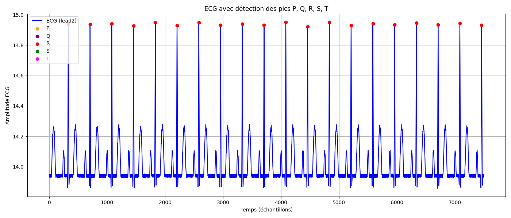

# Labo 01 HPC
_Léonard Jouve_

### But
L’objectif de ce laboratoire est de concevoir et implémenter un système d’analyse automatique de signaux ECG en langage C afin d'en détecter les pics R.

### Implémentation

La structure `ECG_Context` contient les paramètres nécessaire à l'execution de l'algorithme.

La fonction `ecg_create` permet de créer un contexte pour l'ECG avec les paramètres fournis.

La fonction `ecg_delete` permet de supprimer le contexte de l'ECG en deallouant la mémoire.

La fonction `ecg_analyse` analyse le signal fournit en paramètre et détecte l'emplacement ainsi que l'interval des pics R.

Pour celà, nous utilisons l'algorithme de Pan–Tompkins et les fonctions utilitaires fournis.

Nous commençons pas allouer 2 buffers, un d'entrée et un de sortie.
La fonction `memcpy` permet de copier le signal d'entrée dans le buffer d'entrée.
Entre chaque étape, les 2 buffers sont interchangés afin que le résultat de l'étape précédente devienne l'entrée de l'étape suivante.

Finalement afin de déterminer les index des pics R, nous déterminons un seuil à 90% de la valeur maximale du signal à partir duquel des signaux R peuvent être détectés.

On parcours ensuite le buffer de sortie du pipeline pour trouver les signaux R. On cherche ensuite dans une fenêtre de 150ms autours l'index correspondant dans le signal de départ.

Les intervals sont calculés à partir de l'index du pic précédent et de la fréquence d'échantillonage.

### Analyse

La quantité de données à traiter est particullièrement importante pour ce problème.
En effet, la taille des buffers alloués est relative au nombre d'échantillons à traiter. Afin d'améliorer celà, il serait intéressant de ne pas traiter toutes les données d'une seul passe, mais de les fractionner en chunk afin de limiter la taille de mémoire nécessaire.

### Résultats



#### time

En utilisant le programme time, les résultats suivants ont été obtenus.

```
0.01 user
0.00 system
0:00.14 elapsed
15%CPU (0 avgtext, 0 avgdata, 3576 maxresident)
48 inputs
0 outputs
(1major+568minor) pagefaults
0 swaps
```

On constate alors que la quantité de RAM utilisée au maximum est relativement élevée: ~3.5 MB.
Celà est dû au fait que, comme expliqué précédement, les données sont traités en une unique passe.

#### Hyperfine

En utilisant le programme hyperfine, on obtient les résultats suivants:

```
Benchmark 1: ./build/ecg_dealination 80bpm0.csv test.json
  Time (mean ± σ):      63.5 ms ±   9.4 ms    [User: 16.6 ms, System: 2.9 ms]
  Range (min … max):    43.3 ms …  95.6 ms    50 runs
```
